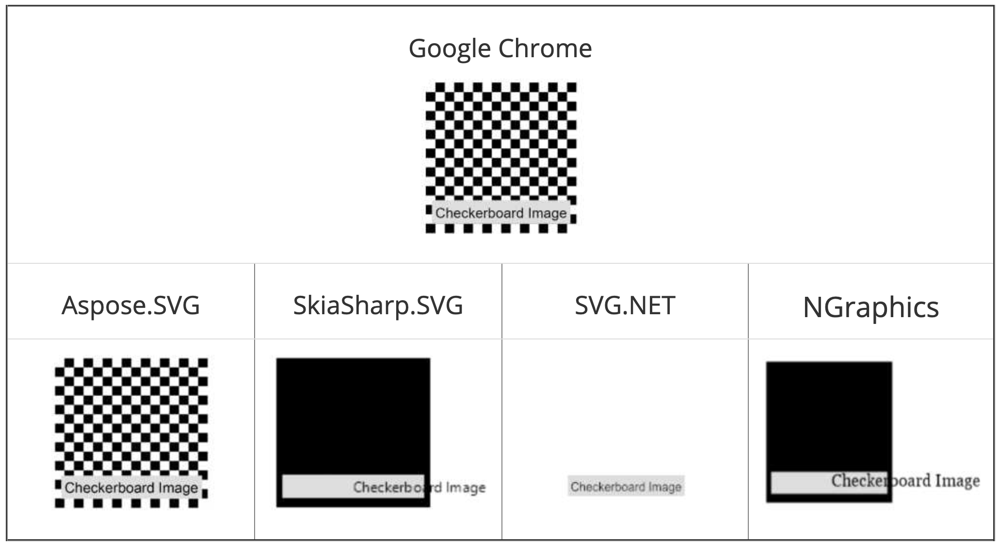
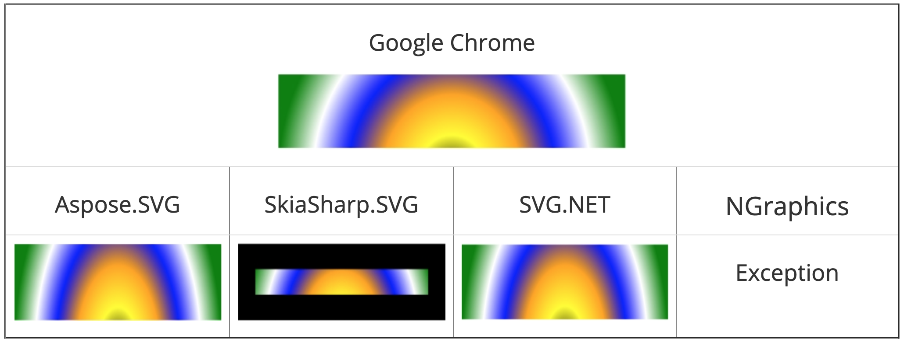
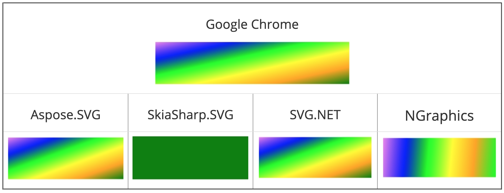

Aspose.SVG for .NET was perceived to be one of the best SVG processing APIs during its design and development phases. That is why the focus remained on high-quality output during the rendering of SVG documents. Outputs generated by the API are always compared with other publicly available .NET libraries. This page shows some comparison of the API in terms of certain features that other APIs either don't support or implement very poorly.

## **Reference Libraries**

The following libraries (applications) are used for rendering quality comparisons.

- Google Chrome
- SkiaSharp
- SVG.NET
- NGraphics

## **Features Comparison**

### **Document Map**

### **Gradient Comparison**

Aspose.SVG supports all the brushes declared in the specification, while other libraries don't.

#### **Radial Gradient**

#### **Linear Gradient**

